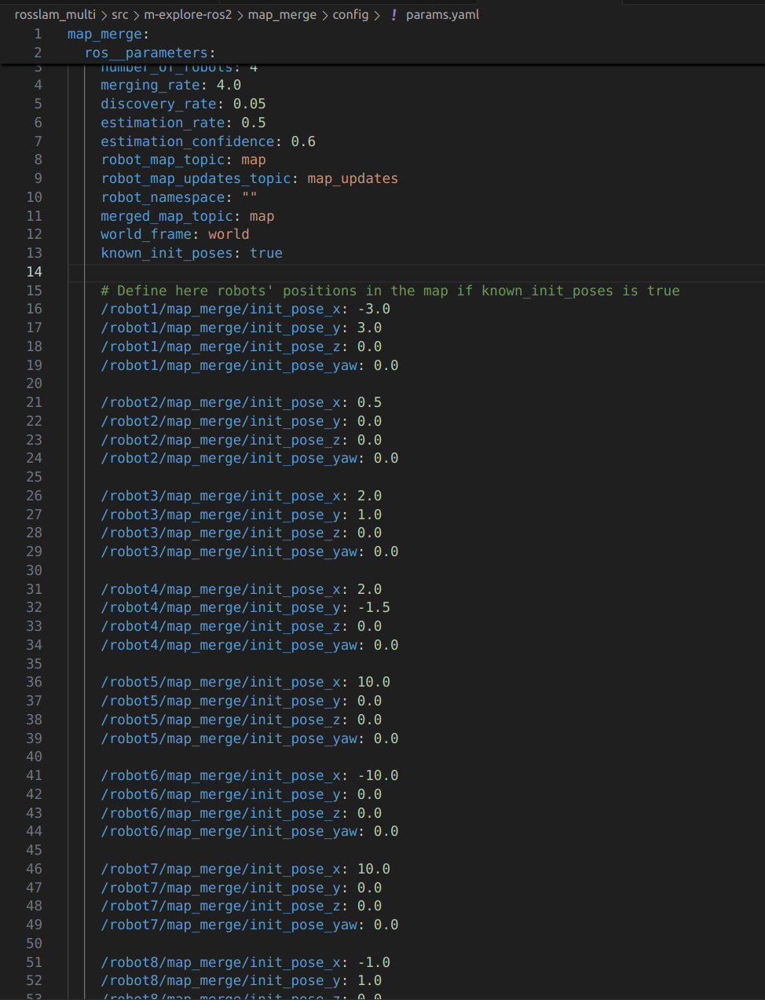
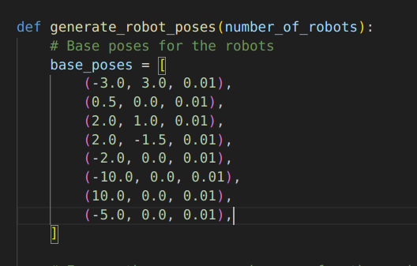

# BharatForge-T30 SWARNA
## INTER-IIT 13.0 Submission

Team 30 *SWARNA: SWarm Autonmous RL-aware Navigation Task Assistant* submission for INTER-IIT problem statement given by *BHARATFORGE KALYANI - CENTRALISED INTELLIGENCE FOR DYNAMIC SWARM NAVIGATION*. 

The aim is to map the given enviornment when a certain number of bots are spawned in an unknown enviornment and to perform efficient task handling. We have used Turtlebot3-Waffle bots for the task.

## PLATFORM USED:

Ubuntu 22.04 LTS

ROS2 Humble

Gazebo 11 Classic

RVIZ


## DEPENDENCIES:
```
xargs -a apt-requirements.txt sudo apt install -y
pip install -r requirements.txt
```

### Turtlebot3
```
git clone https://github.com/ROBOTIS-GIT/turtlebot3_simulations.git -b humble-devel
git clone https://github.com/ROBOTIS-GIT/turtlebot3.git -b humble-devel
git clone https://github.com/ROBOTIS-GIT/turtlebot3_msgs.git -b humble-devel
git clone https://github.com/ROBOTIS-GIT/DynamixelSDK.git -b humble-devel
```

## EXECUTION
To build the workspace -
```
cd ~{PATH}/TEAM30
colcon build
source install/setup.bash
```

```
export GAZEBO_MODEL_PATH=$GAZEBO_MODEL_PATH:{PATH}/TEAM30/src/m-explore-ros2/map_merge/launch/tb3_simulation/models
```

To launch the Gazebo world alongside other individual costmaps -
```
cd ~{PATH}/TEAM30
ros2 launch multirobot_map_merge multi_tb3_simulation_launch.py slam_toolbox:=True
```
To Launch the merged map -
```
~{PATH}/TEAM30 ros2 launch multirobot_map_merge map_merge.launch.py
rviz2 -d ~{PATH}/TEAM30/rosslam_multi/src/m-explore-ros2/map_merge/launch/map_merge.rviz
```


To train the RL models
```
cd ~{PATH}/TEAM30/commands/python3 train_rl.py
```

To start RL exploration -
```
~{PATH}/TEAM30/explore/python3 explore_final.py
```

To start dynamic obstacle avoidance -
```
~{PATH}/TEAM30/commands/python3 nav2.py 
~{PATH}/TEAM30/commands/python3 emergency.py
~{PATH}/TEAM30/commands/python3 collision.py
```

To launch the yolo for individual bot -
```
~{PATH}/TEAM30/commands/python3 individual_yolo.py --robot {Robot_Number}
```

To launch the combined object detection -
```
~{PATH}/TEAM30/commands/python3 dynamic_object_publisher.py
```

To launch task allotment and task execution -
```
~{PATH}/TEAM30/commands/python3 goal_publisher.py
~{PATH}/TEAM30/commands/python3 goal_sender.py
~{PATH}/TEAM30/commands/python3 object_coordinate_publisher.py
~{PATH}/TEAM30/commands/python3 closest_robot_selector.py
```

To launch the LLM GUI interface -
```
~{PATH}/TEAM30/commands/python3 goal_publisher.py
~{PATH}/TEAM30/commands/python3 goal_sender.py
~{PATH}/TEAM30/commands/python3 object_coordinate_publisher.py
~{PATH}/TEAM30/commands/python3 llm.py
```

#### To change the number of Bots:
Change the number of bots as needed in the following path -
```
~{PATH}/TEAM30/rosslam_multi/src/m-explore-ros2/map_merge/config/params.yaml
```

#### To change the world file:
Update the world file in -
```
~{PATH}/TEAM30/rosslam_multi/src/m-explore-ros2/map_merge/launch/tb3_simulation/world
```
We have 3 world files in the above path. To change the world add the corresponding name in the path in line no. 127
```
~{PATH}/TEAM30/rosslam_multi/src/m-explore-ros2/map_merge/launch/tb3_simulation/multi_tb3_simulation_launch.py
```

## RL WEIGHTS:
PATH : 
```
~{PATH}/TEAM30/explore/weights
```
model4.pth is the weights for 4 robots

model6.pth is the weights for 6 robots


## We have to change the following parameters in the following codes

Number of Bots in ~{PATH}/TEAM30/commands/collision.py     

Number of Bots and RL weights in ~{PATH}/TEAM30/explore/explore_final.py  

Number of Bots in ~{PATH}/TEAM30/explore/train_rl.py   

## Params File

Need to specify the number of bots in simulation in the params file



Also need to specify the positions of bots in params file and map_merge/launch/tb3_simulation/multi_tb3_simulation_launch.py



## We have used a network switch to run our simulation on multiple computers at the same time

